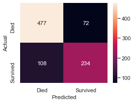

# Titanic Survival Model
***Implementing Classification Techniques to Predict Passenger Survival***

## Background and Problem Statement
For the Kaggle competition, "Titanic - Machine Learning from Disaster," a classification model was developed to determine the outcome (survival or death) of passengers on the Titanic based on personal information such as the passenger gender, age, class, and other categorical and numerical variables.  Datasets were provided by Kaggle and included a training dataset with passenger outcomes for model fitting, and a test dataset on which to run the model and submit the results for the competition. 

## Inital Data, Exploratory Analysis, and Feature Engineering:
A training dataset was provided for 891 passengers aboard the Titanic with a variety of chjaracteristics (features) for each pasenger in the inital dataset.  The table below provides each feature along with information on whether or not it was used in the final model, along with the rationale behind the decision to include or exclude the feature.

| Provided Feature | Used/Dropped | Rationale |
| --- | --- | ---|
| Passenger ID | Dropped | Arbitrary value irrelevant to survival |
| Survived | Used | Necessary to know outcome for each passenger when traiing models |
| Passenger Class (Pclass) | Used | Proved to be a significant indicator of survival |
| Passenger Name | Dropped | Thought to be irrelevant to survival |
| Passenger Sex | Used | Proved to be a significant indicator of survival |
| Passenger Age | Used | Some features extracted from age data were found to be useful |
| No. Siblings/Spouses Aboard (SibSp) | Used | When applicable, this information correlated with survival |
| No. Parents/Children Aboard (Parch) | Used | When applicable, this information correlated with survival |
| Ticket | Dropped | Thought to be arbitrarty data.  Cabin data/class thought to be better survival |
| Fare | Dropped | Thought to be function of cabin and class data which were better survival indicators |
| Cabin | Used | Correlation data showed cabin assignment positively correlated with survival |
| Embarkment Location | Used | Passengers from certain locations had higher chances of survival than others |

Note that while it may have been possible to analyze the ticket, name, and fare data to create engineered features that would correlate to survival outcomes, these activities were not explored in this project for simplicity.  A future iteration of this project should include these feature engineer activities.

### Exploratory Data Analysis and Feature Engineering
The following obsevations were made of the provided features with supporting plots below:
- ***Sex***: Men had a much higher mortailty rate than women
- ***Passenger Class***: Chances of survival decreased with increasing class with the majority of first class passengers surviving and the majorioty of third class passengers perishing.  Due to this trend, it was ultiimately decided that the pasenger class could be treated as a numerical variable despite being categorical in nature
- ***Parch (parents and children) and SibSp (Siblings and spouses)***: From the plots below it can be seen that passengers with no parents, children, siblings, or spouses tended to represent the maojority of the two categories and had much higher mortailty rates.  With this, it was decided that this data would be useful.  While these features were treated as numerical variables in this project, a future iteration should probably treat them as cetagorical as both Parch and SibSp are actually a combination of two distinctly separate features

The following features were created from the provided data:
- ***Presence of Cabin data***:  While only 204 of the 891 passengers were have recorded cabin assignments, being assigned a cabin was asssociated with a much higher survival rate.  Thus a binary "Cabin_data" feature was introduced to the training data

- ***Passenger Age***: Only 714 of the 891 passengers had recorded age data. This particular feature was used in different ways for certain models:
  - A binary feature (Age_data) was introduced to indicate the presence of age data or a lack thereof
  - In some models examined, the passenger ages were kept and a value of 1000 imputed as the age for passengers with missing age data.  This high number was chosen somewhat arbitrarily, but was chosen to be outside of the range of possible passenger ages so as to minimize the impact to any age trends present in the data
  - When examining age data, it could be seen that younger passengers appeared to have a higher chance or survival. Analysis was performed to investigate how young a passenger needed to be in order to have a disticntly higher chance of survival. To do this, the ratio of passengers from a cumulative age group (ages 0 to n) that survived to those from that same age group that perished was plotted.  It could be seen that age nine was the age which all younger passengers appeared to be twice as likely to survive.  From this, a binary feature named "Young" was introduced for passengers whose recorded age was under nine years old.  Passengers with ages recorded to be younger than 9 were ecnoded as a 1, while older passengers and passngers without recorded age data were encoded as 0.  To verify the statistical significance of this finding, a probability mass fucntion was used to determine the likelyhood that 38 out of the 62 passengers below age nine would survive given the null hypothesis that all passengers had an equal chance or survival at 68% (equal to the overallpercentage of passengers who died on the Titanic.  With the chances of this happening being .00015%, it was determined that this null hypothesis could be rejected and that there was a significant correlation between a young age and survival

  

## Modeling
Four types of models were run on the provided data:
- Logistic Regression
- K-Neighbors
- Decision Tree
- Random Forrest

### Exploratory Models
Initially, a logisitic regression model was run with default parameter values and a training dataset with only the Class, Sex, Parch, SibSp, Fare, and Embarkment data.  The results are shown in the confusion matrix below with an accuracy of 79.80 % aginast the training data.  The model was then run against 30 training and validation datasets created from the provided training data (see *Model Evaluation with ShuffleSplit* below) yielding similar average model accuracies of 79.61% and 79.56% for the training and validaiton sets respectively.

The charactersistics of the mis-categorized passengers from the from the initial model were examined in combination with the regression coefficients assigned to each feature.  It was shown that the model treated passenger sex as the most important characteristic in determining mortality but this resulted in a much predicted higher mortality rate for men compared to actual passenger data (97.9% versus 81.1%) and a much lower mortality rate for women than what the actual passenger data showed (3.5% versus 14.0%).  Other features such as passenger class were of lesser importnance to the model, and had they been more highly weighted during training, could have produced a more accuracte model.

**From here, additional feautres were added to the training data used for the default logistic regression model and yielded improved accuracy, and the modeling process sought include hyperparaemter optimization while exploring other types of classification models.  Later, a table will show these added feautres (passenger charactersistics) for the models examined in the following sections.**

### Model Evaluation with ShuffleSplit
For all combinations of hyperparameters and model varieties below, the models were evaluated based on their performance against validation datasets created from the original traiing data.  This was done to select models with reduced overfitting and better performance on unseen data.  This was executed in the following manner:
- The "ShuffleSplit" function was used to break the training data into 30 randomized training and validation datasets where 30% of the data for each split was allocated to the validation set
- The cross-validation funciton within GridSearchCV was set to employ the ShuffleSplit function and run each model iteration through the same 30 training and validation splits
- For each model iteration, the average model accuracy against the 30 training and validation datasets was reported
- The model with the highest accuracy against the validation data was selected as the "best" model and either selected for further optimization or as the final model for a particular model type

### Model Optimization
The general modeling strategy for optimizing each model type was executed as follows:
- Run a baseline model with default parameters to esablish an initial performance benchmark
- Perform a "Coarse Parameter Optimization" with GridSearchCV to run the model on every cobination of a wide range of hyperparameter values
- Perform a "Fine Tuning" optimization where the hyperparameter ranges are much smaller and centered around the best performing hyperparameter combinations (those producing ithe best model accuracy against validation datasets, explained above) from the coarse optimization step
- Run the best performing hyperparameters from the fine tuning step to output a final prediction of the validation data
- Repeat the above steps on all model types

### Model Comparison and Selection
The table below shows a summary of all optimized model varieties along with the initial logistic regression model, "First LR".  The features used in each model are also provided.  Note that in every training dataset for all models, the Class, Sex, SibSp, and Parch data were included, and are not shown individually in the columns below.  Both the accuracy of the models aginst the validaiton datasets and the accuracy against the full training dataset (not split into validation and traiing subsets) are provided.

| Model & Type | Validation Dataset Accuracy | Fare | Cabin_Data | Age (Imputed) | Young |
| --- | :-: |  :-: |  :-: |  :-: |  :-: |
| First LR (logistic regression) | 79.6% | X | | | |
| Best LR (logistic regression) | 81.5% | | X | | X |
| Best K-Nearest Negieghbors | 82.0% | | X | | X |
| Best K-Nearest Negieghbors w/Age data | 80.5% | | X | X | |
| Best Decision Tree w/Age data | 81.6% | | X | X | |
| Best Random Forest Classifier w/Age data | 82.3% | | X | X | |

Across the models listed above, inconsistencies can be observed in relation to which age feature was included.  Most noteably, the Young feature was not a part of the training data for the decision tree and random forest model types, and replacing this feature with imputed age data actually had a negative impact on the accuracy of the model against the validation datasets. An attempt was made to determine the impact of the Young feature on the decision tree and random forest classifiers by examingin the prediction accuracy against the full training dataset.  ***In a future iteration of this project, these models must be re-optimized around the training dataset with the young feature with training/validation splits for proper comparison to other models.***

Given its highest accuracy on the validation data above, the optimized random forest model using training data with the imputed age data was selected to predict the passenger test dataset.  The entire training dataset with the correct features was then used to train the selected model to predict the test dataset provided by Kaggle.

## Passenger Test Dataset, Predictions, and Results
With the selected model, the process of predicting the outcomes of the previously unseen 418 passengers in the test data provided was performed as follows.  Note that being a KAggle competition, the actual passenger outcomes were provided, and the only feedback on the model performance against the test data was a single accuracy score provided after the model predicitons were submitted.
- The test data were examined to ensure that they were sufficiently similar to the original training data to be properly processed by the model
- The necessary features were removed/added and data imputed to test data in a manner consistent with the training data used to fit the selected model
- Predictions from the optimized random forest classifier model were submitted and yielded a reported accraucy of only around 70%, which is far lower than the predicted 82% on the validation data
- Upon the completion of post-submission analysis described below, the model was modified to attain an improved acruay of 77.3%

## Post-submission Model Analysis
***Note:  What is discussed in this section is a "guess-and-check" method to try to uncover some of the root causes behind the model's poor performance.***
***It is understood that this is not a legitimate means of model refinement as the true classifications of unseen data typically remain unknown.***
- A more intense examination of the test data showed that the composition of values for each feature (passenger characterissit) were statistically similar to the training dataset, and in the same proportions.  In other words, the propertions of men to women, each of the classes, and different values of all other featuers were nearly identical

- In the prcoess of troublshooting the model and submitting multiple additional passenger predictions, it was discovered that the prediction accuracy of the model was highly variable even without any parameters of the model chaning
- It was eventually determined that the "random state" parameters in the various functions used in this model were not set to a constant value.  Further, changing the random state parameter for the random forest classifier algorithm itself caused the model predictions to vary drastically for the same model on the test data
- As a simple test of model vairability, the final model was run with a range random forest values from 0 to 29 and output pasenger predictions for both the passengers in the training dataset and the test dataset.  On the training dataset, the model predicted that between 30.8% and 34.3% of the passengers would survive across all random state values.  However, the test data results predicted that between 32.8% and 46.2% of the passengers would survive.  Thus, the model's performance on the test data was far more variable than on the training data
- The model was resubmitted several times, and a random state of 6 was found to provide an improved

## Next Steps and POssible Model Refinements
Further investigation of model variability is required.  In addition, the attached code also point out the following areas to focus on in future iterations of this project:
- Prgressively adding features to track model performance and understand feature importance
- Invest more effort into feature engineering and supporting data analysis
- Treat some of the numerical featerus like class as categorical and not numerical data
- Try additional model varieties and techniques such as support vector machines and gradient boosting
